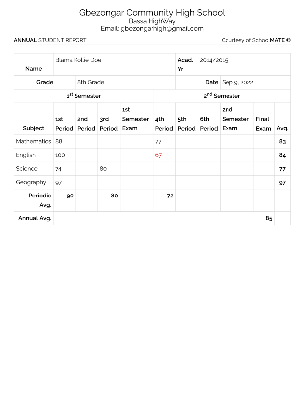

# Instructions

With just HTML, markup an annual Report Card for the favorite High School and your favorite student. You can use an High School an Report Card as a reference.

- It should have a school's name
- It should have the student's name
- It should have the student's class/grade
- It should have sample grades for the student
- It should have an area for signatures
- It should have an area for the 

**Here is an example of an annual Report Card**

